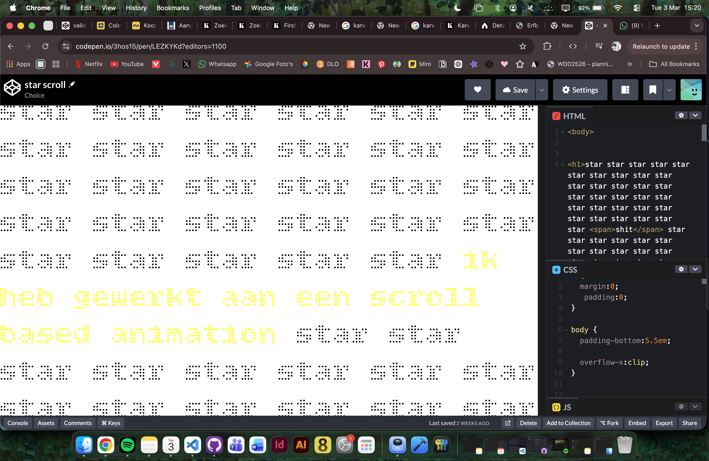
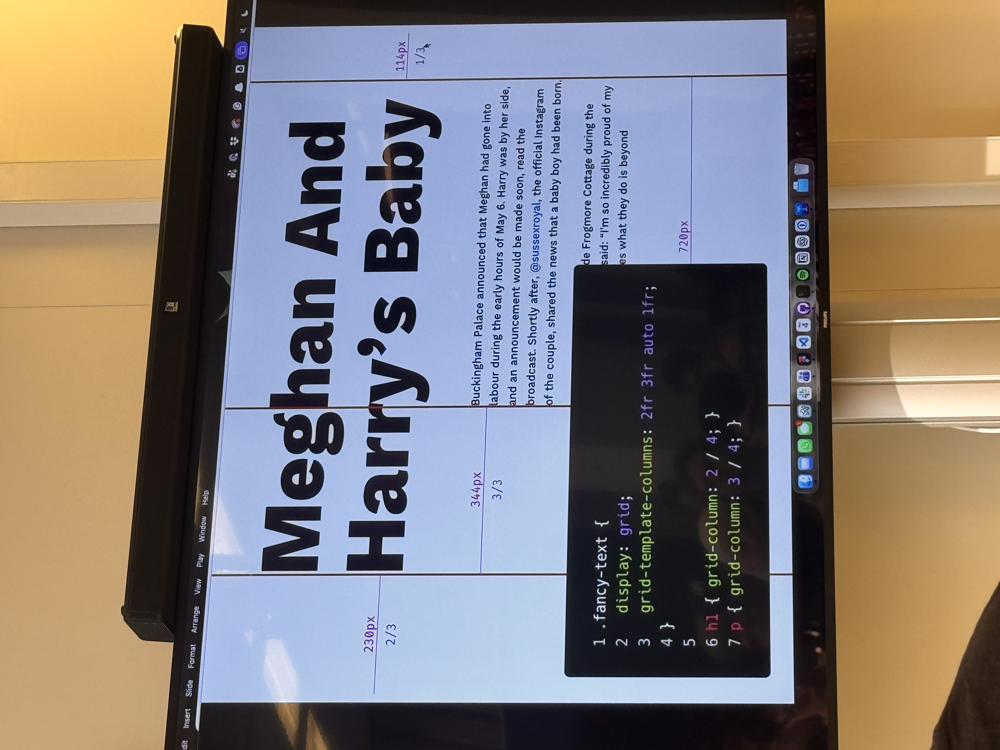
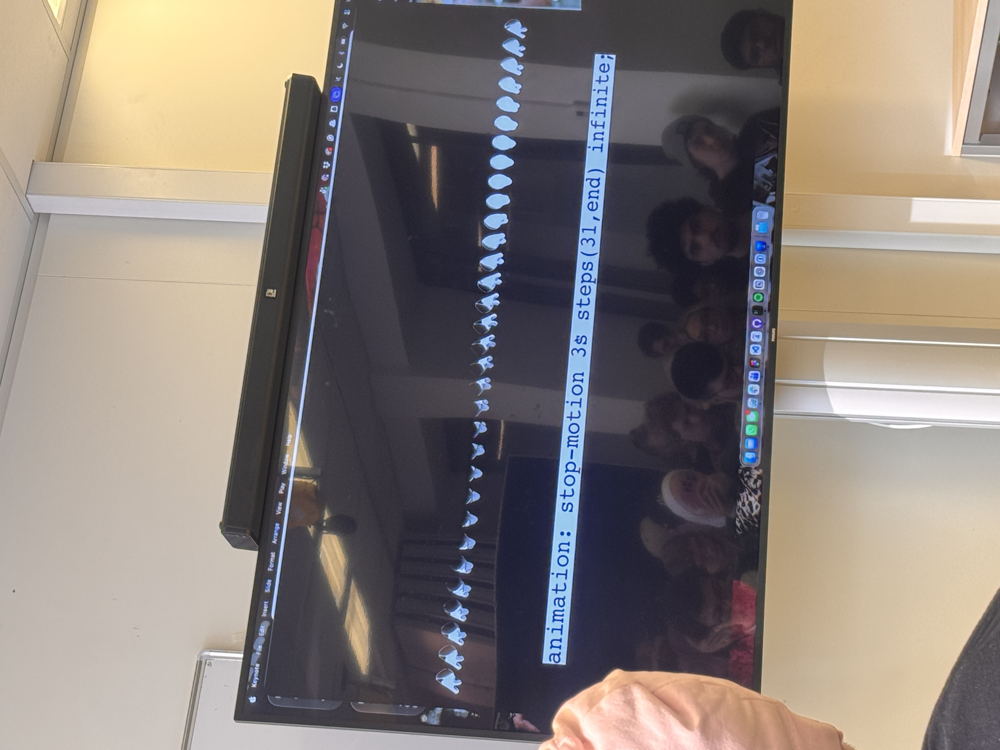
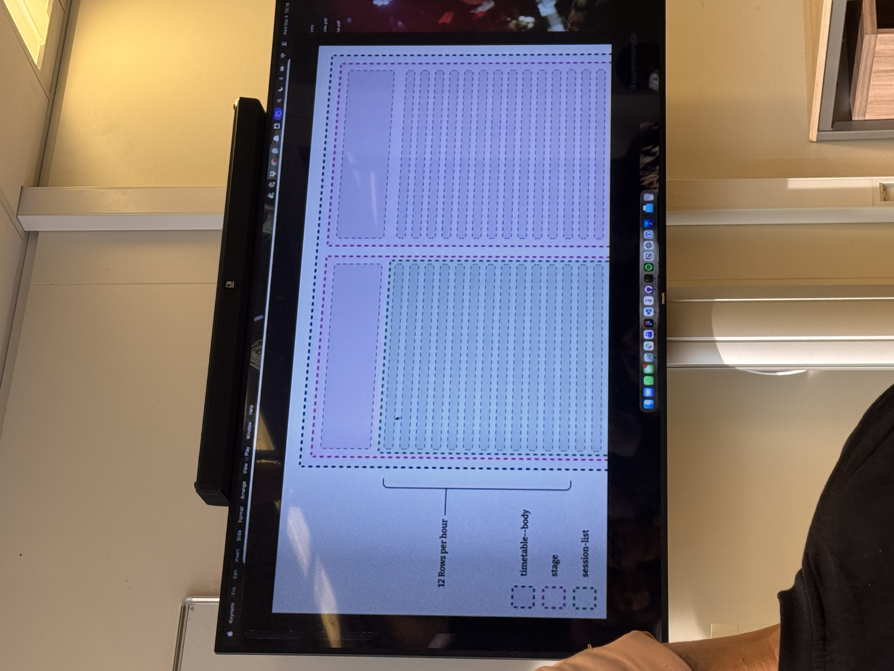
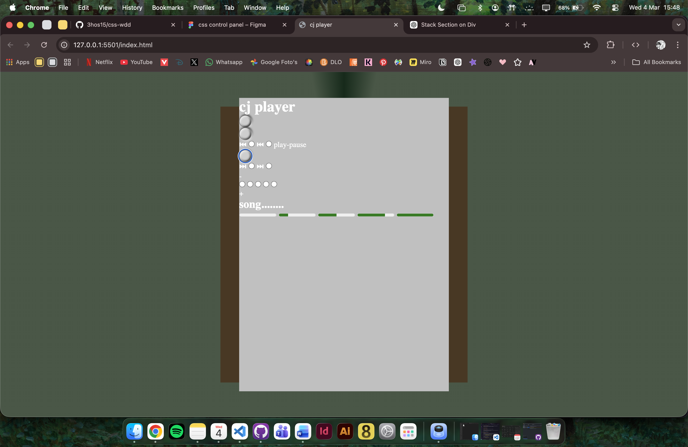

## Week 1

### Dag 1 - woensdag 18 feb

**Wat heb ik vandaag gedaan:**
introductie CSS, opdracht gekozen (control panel) en begonnen met de code

**Wat heb ik geleerd:**
Ik heb nieuwe dingen geleerd over scroll driven animations. Ik heb in een codepen gewerkt voor de opdracht die we moeten presenteren

**Wat ga ik morgen doen:**
Kort presenteren over scroll driven animation en verder werken aan de CSS opdracht

---

### Dag 2 – donderdag 19 feb

**Wat heb ik vandaag gedaan:**

Presentatie css scroll driven animation gegeven met een groepje. Opnieuw een idee bedacht voor de CSS opdracht en daar een ontwerp voor gemaakt in Figma zodat ik me beter kon verbeelden hoe het eruit moet komen te zien  

**Wat heb ik geleerd:**
Veel van de andere presentaties die de studenten hebben gemaakt. 

**Wat ga ik morgen doen:**
feedback presentaties

---

### Reflectie Week 1
In week 1 lag de focus op het kennismaken met CSS en het opstarten van de opdracht. Op de eerste dag ben ik begonnen met een eerste idee voor mijn control panel en ben ik direct gestart met coderen. Tijdens het werken merkte ik echter dat dit idee toch niet helemaal aansloot bij wat ik wilde maken. Het voelde nog niet sterk genoeg en ik liep een beetje vast in hoe ik het verder moest uitwerken. Daarom heb ik besloten om mijn oorspronkelijke idee los te laten en het later om te gooien naar een nieuw concept.

Naast mijn eigen opdracht heb ik ook gewerkt aan een kleine opdracht over scroll driven animations. Dit heb ik samen met twee andere studenten gedaan. Hiervoor hebben we in CodePen gewerkt om de techniek te verkennen en beter te begrijpen hoe het werkt. Dit stond los van mijn eigen CSS-opdracht, maar gaf wel nieuwe inzichten in wat er mogelijk is met animaties in CSS.

Op de tweede dag heb ik samen met mijn groepje een presentatie gegeven over scroll driven animations. Door dit te presenteren, moest ik de stof goed begrijpen en duidelijk kunnen uitleggen, wat hielp om het beter te onthouden. Ook heb ik veel geleerd van de presentaties van andere studenten, omdat zij weer andere onderwerpen en technieken behandelden.

Na de presentatie heb ik mijn idee voor de CSS-opdracht opnieuw bekeken en besloten om het anders aan te pakken. In plaats van meteen te beginnen met coderen, heb ik eerst een ontwerp gemaakt in Figma. Dit hielp mij om een duidelijker beeld te krijgen van hoe het eindresultaat eruit moest zien en welke onderdelen ik nodig had. Hierdoor kon ik gerichter werken en voorkwam ik dat ik opnieuw vast zou lopen zoals bij mijn eerste idee.

Wat goed ging deze week, is dat ik flexibel ben geweest in mijn proces en niet bang was om mijn idee aan te passen. Het was soms lastig om iets los te laten waar ik al tijd in had gestoken, maar uiteindelijk zorgde dit ervoor dat ik met een beter en duidelijker concept verder kon. Ook vond ik het positief dat ik actief heb meegedaan aan de presentaties en daarvan heb geleerd.

Wat ik volgende week beter wil doen, is sneller kritisch kijken naar mijn eigen werk en eerder beslissingen nemen als iets niet goed werkt. Daarnaast wil ik mijn workflow verbeteren door eerst beter te plannen en schetsen voordat ik begin met coderen, zodat ik efficiënter kan werken.

Al met al was het een leerzame eerste week waarin ik niet alleen nieuwe CSS-technieken heb ontdekt, maar ook meer inzicht heb gekregen in mijn eigen werkproces en hoe ik dat kan verbeteren.

---

## Week 2

### Dag 4 – woensdag 4 maart

* Weekly nerd 

Nils bilder, 9elements - CSS to the rescue

Ux designer en frontend developer

How to combine creativeness and stricter company works

They used to use photoshop to design websites 

Figma is similar to css designing - there’s lots of bridges 

Tailwind chatgpt and figma - holy trinity of boredom

Don’t look at pixel but at parts  

Use fr unit to make white space with grid

Flip book made out of images, steps function - rurhsummitb  

Subgrids - grid within a grid - written on the blog  

First line selector 

View transitions between different pages 

Bonabry.de

bonamic.de 

* Gradients workshop 
https://codepen.io/3hos15/pen/QwKyxdV

Verschillende soort gradients gemaakt en animeren met een custom property

* Advanced layout workshop 
https://codepen.io/3hos15/pen/pvEgZzz?editors=1100

Uitleg over advanced grid layout

Holy Albatross layout 
https://css-tricks.com/holy-albatross-with-widths/

Resize  
https://developer.mozilla.org/en-US/docs/Web/CSS/Reference/Properties/resize

**Wat heb ik vandaag gedaan:**
Vandaag heb ik de workshops gradients en advanced layout gevolgd. De gradients workshop was makkelijk te volgen en voor mij was dit nieuwe informatie omdat ik er nog niet eerder mee heb gewerkt. Deze methode wil ik ook gaan toepassen in mijn css control panel.

De advanced layout workshop vond ik iets moeilijker om te volgen. Het ging vooral over grid, waar ik wel vaker mee heb gewerkt maar dit was toch een tikkeltje moeilijker. Het was uitaard wel goede informatie die ik ook kan gebruiken, maar ik zou me nog even meer moeten inlezen om het beter te gebrijpen en zodat ik echt weet wat ik doe.

Verder ben ik bezig geweest met de css opdracht. Als het goed is zit alle input/controls correct in de HTML dus ben ik begonnen met het stylen. Ik vond het nog al lastig om te zien waar ik moet beginnen, maar ik wil eersye de basis erin hebben en dat nog dieper stylen. 

**Wat heb ik geleerd:**
Gradients en advanced layout.

**Wat ga ik morgen doen:**
Verder met het stylen van de css opdracht en voorbereiden op de tweede weekly nerd van de week.

---

### Reflectie Week 2
In week 2 lag de focus meer op het verdiepen van mijn CSS-kennis en het verder uitwerken van mijn control panel. Tijdens de Weekly Nerd heb ik een presentatie gezien van Nils Binder van 9elements. Dit ging over de combinatie van creativiteit en werken binnen de kaders van een bedrijf. Wat mij vooral bijbleef is dat je niet te veel moet focussen op pixels, maar meer op onderdelen en structuur. Ook vond ik het interessant om te horen hoe tools zoals Figma en CSS dichter bij elkaar liggen dan je misschien denkt.

Daarnaast heb ik nieuwe CSS-technieken geleerd tijdens de workshops. In de gradients workshop heb ik voor het eerst gewerkt met verschillende soorten gradients en hoe je deze kunt animeren met custom properties. Dit vond ik goed te volgen en ook direct toepasbaar op mijn eigen project. Ik wil deze techniek gebruiken in mijn control panel om het visueel interessanter te maken.

De advanced layout workshop vond ik een stuk lastiger. Hoewel ik al eerder met grid heb gewerkt, ging dit een stuk dieper en kwamen er concepten voorbij die ik nog niet volledig begrijp, zoals complexere layouts en technieken zoals de “Holy Albatross”. Ik merkte dat ik hier nog niet alles uit kon halen en dat ik dit later nog een keer rustig moet doornemen om het echt goed te begrijpen.

Naast de workshops ben ik verder gegaan met mijn CSS-opdracht. Ik heb eerst gezorgd dat alle inputs en controls goed in de HTML stonden, zodat ik daarna kon beginnen met stylen. Dit vond ik nog best lastig, omdat ik niet goed wist waar ik moest beginnen. Ik heb ervoor gekozen om eerst de basis neer te zetten en daarna pas meer detail en styling toe te voegen. Dit gaf iets meer houvast, maar ik merk nog steeds dat ik soms zoekende ben in mijn aanpak.

Wat goed ging deze week, is dat ik nieuwe technieken heb geleerd en ook al ben gaan nadenken over hoe ik deze kan toepassen in mijn eigen project. Ook heb ik een goede basis gelegd voor mijn control panel door de HTML op orde te krijgen.

Wat ik volgende week beter wil doen, is meer tijd nemen om moeilijke onderwerpen, zoals advanced grid, echt te begrijpen in plaats van ze alleen globaal te volgen. Daarnaast wil ik gerichter werken aan mijn styling en vooraf beter bedenken welke stappen ik ga nemen, zodat ik minder tijd kwijt ben aan twijfelen waar ik moet beginnen.

---
## Week 3

### Dag 6 – woensdag 11 maart
**Wat heb ik vandaag gedaan:**  
Vandaag heb ik de workshops Container style queries (voor themes) van Sanne en gekke dingen maken met Cyd gevolgd.

https://codepen.io/3hos15/pen/jEMVGeG  
https://codepen.io/3hos15/pen/vEXyewN  
https://codepen.io/3hos15/pen/qEaqVZB  

https://codepen.io/3hos15/pen/WbGoMQw  
https://codepen.io/3hos15/pen/qEaqxog  

Verder heb ik de code van de workshop van Sanne toegepast in mijn eigen code en wat verder gegaan met de styling

**Wat heb ik geleerd:**  
Bij de workshop van Sanne heb ik geleerd over stylen van een paginas met @container style(). Ik realiseerde me dat dezelfde soort code van de laatste codepen goed kan gebruiken voor mijn CSS opdracht omdat ik met values werk voor de volume van de cd speler.  

Bij Cyd gingen we aann de slag met scroll based animations (met keyframes) en parallax. Ik had nog niet eerder een parallax gemaakt dus dit was veel nieuwe informatie maar opzich wel goed te volgen

**Wat ga ik morgen doen:**  
Morgen wil ik alle onderdelen van de cd speler op de goede plek krijgen op de pagina en de inputs gaan linken aan wat ze echt moeten doen, dus bijv. cd speler aan en uit en de muziek skippen.

---

### Dag 5 – donderdag 12 maart
**Wat heb ik vandaag gedaan:**  
Vandaag heb ik de workshops Masks van Sanna gevolgd en fonts van Vasilis gevolgd.
https://codepen.io/3hos15/pen/ByLpypq
https://codepen.io/3hos15/pen/vEXgEmd

Daarnaast heb ik hard gewerkt aan mijn code voor CSS. Ik heb de inputs laten werken met :has en :checked. 

Ook heb ik me voorbereid op de weekly nerd.

**Wat heb ik geleerd:**  
Over animeren en clippen met masks en wat je allemaal kan doen met fonts 
**Wat ga ik morgen doen:**  
Volgende week ga ik verder met het stylen van de site. Op dit moment zit alles wel op zn plekje maar het moet er natuurlijk wel goed uit ziens

--- 
### Week 3 reflectie
In week 3 lag de focus vooral op het verder uitwerken van mijn CSS-opdracht en het toepassen van meer geavanceerde technieken. Tijdens deze week heb ik meerdere workshops gevolgd die direct invloed hadden op mijn project, waardoor ik steeds beter begon te begrijpen hoe ik mijn idee technisch kan realiseren.

Tijdens de workshop van Sanne over container style queries heb ik geleerd hoe je styling kunt aanpassen op basis van de container in plaats van alleen de viewport. Dit gaf mij nieuwe inzichten, vooral omdat ik werk met een component (de cd-speler) waarin veel onderdelen afhankelijk zijn van elkaar. Ik merkte dat ik deze techniek goed kon toepassen in mijn eigen project, bijvoorbeeld bij het werken met waardes zoals volume. Hierdoor kreeg mijn project niet alleen meer functionaliteit, maar ook een betere structuur.

Daarnaast heb ik bij de workshop van Cyd gewerkt met scroll based animations en parallax effecten. Parallax was nieuw voor mij, maar wel interessant omdat het zorgt voor meer diepte en beweging in een ontwerp. Hoewel ik dit nog niet direct volledig in mijn eigen project heb toegepast, heeft het mij wel een beter beeld gegeven van wat er mogelijk is met animaties in CSS.

Op de tweede dag heb ik workshops gevolgd over masks en fonts. Vooral masks vond ik interessant, omdat je hiermee vormen kunt maken en onderdelen kunt animeren op een manier die met standaard CSS moeilijker is. Dit gaf mij weer nieuwe ideeën voor de visuele kant van mijn control panel. De workshop over fonts liet zien hoeveel invloed typografie kan hebben op een ontwerp, iets waar ik in mijn eigen project ook bewuster naar wil kijken.

Naast de workshops ben ik veel bezig geweest met mijn eigen code. Een belangrijk onderdeel deze week was het werkend krijgen van interactie met behulp van :has en :checked. Hiermee heb ik ervoor gezorgd dat mijn inputs daadwerkelijk iets doen, zoals het aan- en uitzetten van de cd-speler en het aanpassen van bepaalde states. Dit was soms best lastig, maar gaf wel een goed gevoel toen het begon te werken. Ik merk dat ik steeds beter begin te begrijpen hoe ik CSS niet alleen voor styling, maar ook voor interactie kan gebruiken.

Wat goed ging deze week, is dat ik technieken uit de workshops direct heb geprobeerd toe te passen in mijn eigen project. Hierdoor bleef de stof beter hangen en zag ik ook meteen het nut ervan. Ook ben ik een stuk verder gekomen met de functionaliteit van mijn control panel, wat mij meer vertrouwen geeft in mijn voortgang.

Wat ik volgende week beter wil doen, is nog meer structuur aanbrengen in mijn code. Doordat ik veel nieuwe dingen uitprobeer, wordt mijn CSS soms wat rommelig. Daarnaast wil ik beter plannen welke onderdelen ik wanneer ga maken, zodat ik gerichter kan werken in plaats van alles een beetje door elkaar te doen.
